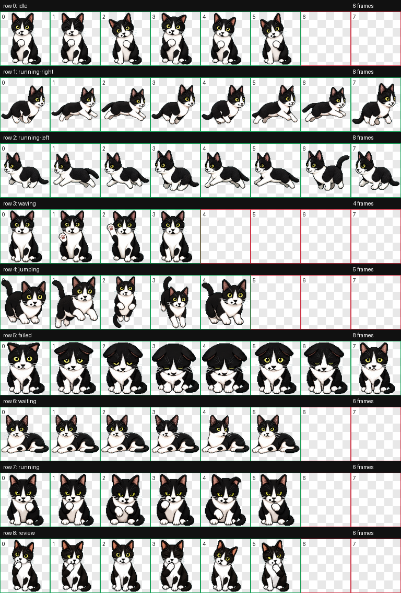

# 福福 Codex Pet

福福是一只黑白奶牛猫像素风 Codex 宠物。

它的状态设计是：

- 平时默认坐着。
- 等待用户输入或等待太久时会趴下。
- 工作、review、失败、跳跃、挥手等状态都有独立动画。



## 安装方法

### 推荐方法：让 Codex 帮你安装

把这个仓库地址发给 Codex：

```text
https://github.com/HuYee2025/fufu-codex-pet
```

然后告诉 Codex：

```text
帮我安装这个 Codex 宠物
```

Codex 会下载仓库，并把里面的 `fufu` 文件夹放到你的本地宠物目录：

```text
~/.codex/pets/fufu/
```

安装完成后，刷新或重启 Codex，在自定义宠物里选择 `福福`。

### 方法一：下载 ZIP 手动安装

1. 在 GitHub 页面点击 `Code` -> `Download ZIP`。
2. 解压后找到里面的 `fufu` 文件夹。
3. 把整个 `fufu` 文件夹放到你的 Codex 宠物目录：

```bash
mkdir -p ~/.codex/pets
cp -R fufu ~/.codex/pets/
```

最终目录应该长这样：

```text
~/.codex/pets/fufu/
  pet.json
  spritesheet.webp
```

4. 重启或刷新 Codex。
5. 在自定义宠物里选择 `福福`。

### 方法二：用 Git 手动安装

```bash
git clone https://github.com/HuYee2025/fufu-codex-pet.git
mkdir -p ~/.codex/pets
cp -R fufu-codex-pet/fufu ~/.codex/pets/
```

然后重启或刷新 Codex，在宠物列表里选择 `福福`。

## 文件说明

```text
fufu/
  pet.json           # Codex 宠物配置
  spritesheet.webp   # 8 x 9 动画图集
assets/
  preview-contact-sheet.png
```

## 卸载

删除本地宠物目录即可：

```bash
rm -rf ~/.codex/pets/fufu
```

## 说明

这个仓库只包含成品宠物文件和预览图，不包含原始照片或中间生成素材。
